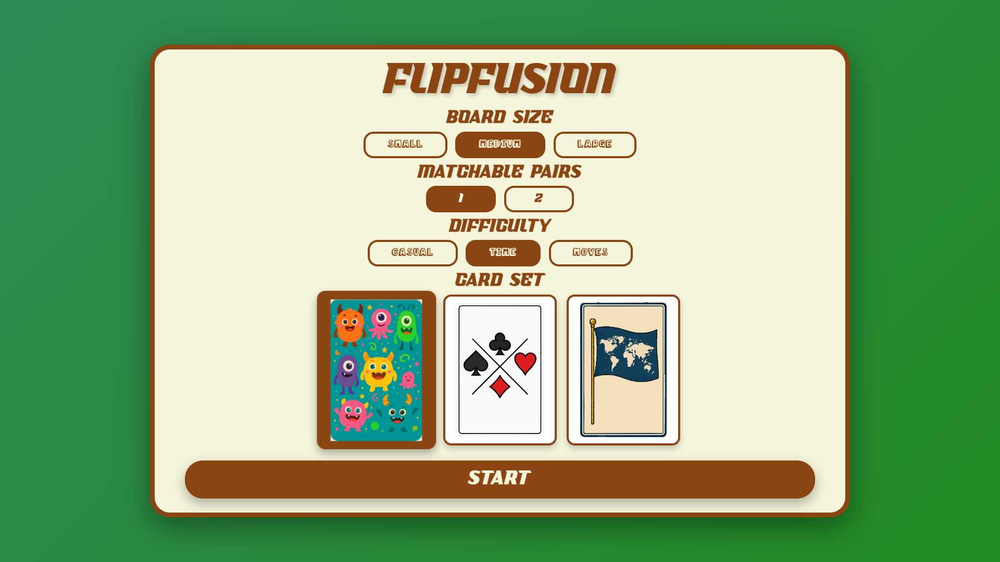
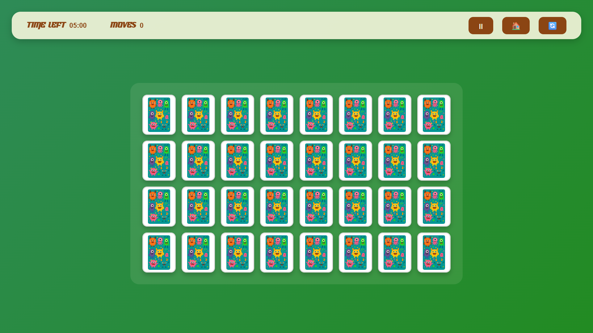
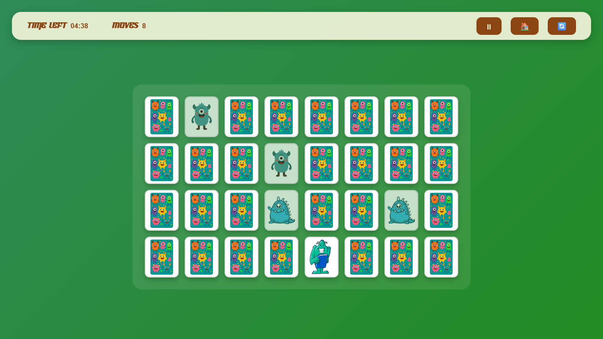

# FlipFusion - Memory Matching Game

## Description

FlipFusion is a modern, browser-based memory matching card game built with vanilla HTML, CSS, and JavaScript. This engaging puzzle game challenges players to find matching pairs of cards by flipping them over, testing memory skills and concentration. The game features multiple difficulty levels, customizable board sizes, three unique card themes, and a comprehensive asset loading system for optimal performance.

**Genre:** Puzzle / Memory  
**Platform:** Web Browser (Cross-platform)
**Play here 👉🏻** - [https://flipfusion.vercel.app]

## Demo & Screenshots

### Game Configuration Screen

*Configure your game with different board sizes, difficulty modes, and card themes*

### Gameplay - Cards Face Down

*Medium board (4×8) with monsters card set - all cards face down at start*

### Gameplay - Finding Matches

*Cards revealed during gameplay showing the matching mechanic in action*

## Features

### Gameplay Features
- **Multiple Board Sizes**: Small (4×4), Medium (4×8), Large (5×8)
- **Difficulty Modes**: 
  - Casual (unlimited time and moves)
  - Time Mode (race against the clock)
  - Moves Mode (limited number of moves)
- **Three Card Themes**: Monsters, Classic Cards, World Flags
- **Matchable Pairs**: Choose 1 or 2 pairs per card type for varied difficulty
- **Progress Tracking**: Real-time moves counter and timer display
- **Game Controls**: Pause/resume, reset, and home navigation

### Technical Features
- **Pure Vanilla JavaScript**: No external dependencies or frameworks
- **Responsive Design**: Optimized for all devices (mobile, tablet, desktop)
- **Asset Loading System**: Progressive loading with cache storage for offline play
- **Performance Optimized**: GPU acceleration and smooth animations
- **Local Storage**: Saves game configuration preferences
- **Full-Screen Experience**: Immersive gameplay without browser interference

## Installation

### Method 1: Local Development
1. **Clone or download** the project files
2. **Install Python** (3.11 or higher recommended)
3. **Navigate to the project directory** in your terminal
4. **Start the local server**:
   ```bash
   python -m http.server 5000
   ```
5. **Open your browser** and go to `http://localhost:5000`

### Method 2: Deploy on Replit
1. **Import the project** to Replit
2. **Install Python 3.11** if not already available
3. **Run the project** - the workflow will automatically start the server
4. **Access your game** through the Replit webview

### Method 3: Static Hosting
Deploy the project files to any static hosting service:
- **GitHub Pages**
- **Netlify** 
- **Vercel**
- **Any web server** with static file serving

## How to Play

### Getting Started
1. **Configure Your Game**: Choose board size, difficulty mode, number of matchable pairs, and card theme
2. **Click START** to begin playing
3. **First Click**: Timer starts when you flip your first card

### Gameplay Rules
- **Objective**: Find all matching pairs to win the game
- **Card Flipping**: Click any face-down card to reveal it
- **Matching**: Click a second card to see if it matches the first
- **Success**: Matching cards stay face-up and count toward your progress
- **No Match**: Cards flip back over after a brief delay
- **Memory Challenge**: Remember card positions to find matches efficiently

### Game Controls
- **Pause Button**: Pause/resume the game timer
- **Home Button**: Return to configuration screen (resets current game)
- **Reset Button**: Restart the current game with same settings

### Difficulty Modes
- **Casual**: Play at your own pace with unlimited time and moves
- **Time Mode**: Race against a countdown timer based on board size
- **Moves Mode**: Complete the puzzle within a limited number of moves

## Technologies Used

- **HTML5**: Semantic markup and modern web standards
- **CSS3**: 
  - Flexbox layouts
  - CSS Grid for responsive card arrangement
  - CSS animations and transitions
  - Custom properties (CSS variables)
  - Responsive design with multiple breakpoints
- **JavaScript (ES6+)**:
  - Classes and modules
  - Cache Storage API
  - Local Storage API
  - RequestAnimationFrame for smooth animations
- **SVG Graphics**: Scalable vector assets for crisp display on all devices
- **Python**: HTTP server for local development
- **Web APIs**:
  - Cache Storage for offline capability
  - Local Storage for configuration persistence

## Project Structure

```
FlipFusion/
├── index.html              # Main HTML file with all game screens
├── styles.css              # Complete styling and responsive design
├── script.js               # Game logic, asset loading, and state management
├── README.md               # Project documentation
├── replit.md               # Technical architecture and development notes
└── assets/                 # Game assets directory
    ├── fonts/              # Custom fonts
    │   ├── font1.ttf
    │   └── font2.ttf
    ├── cards_set_monsters/ # Monster-themed cards (25 PNG images)
    │   ├── monsters_cards_back.svg
    │   └── monster1.png - monster25.png
    ├── cards_set_classic/  # Classic playing cards (100 SVG images)
    │   ├── classic_cards_back.svg
    │   └── classic1.svg - classic100.svg
    └── cards_set_flags/    # World flags (100 SVG images)
        ├── flags_cards_back.svg
        └── flag1.svg - flag100.svg
```

## Contributing

Contributions are welcome! Here's how you can help improve FlipFusion:

### Areas for Contribution
- **New Card Sets**: Add themed card collections with appropriate SVG/PNG assets
- **Game Modes**: Implement additional difficulty variations or game types
- **Accessibility**: Improve keyboard navigation and screen reader support
- **Animations**: Enhance card flip animations and visual effects
- **Sound Effects**: Add audio feedback for card flips and matches
- **Themes**: Create alternative color schemes and visual themes

### Development Guidelines
1. **Maintain Vanilla JavaScript**: Keep the project framework-free
2. **Follow Existing Code Style**: Use the established class-based architecture
3. **Test Responsiveness**: Ensure changes work across all device sizes
4. **Update Documentation**: Modify `replit.md` for architectural changes
5. **Asset Standards**: Use SVG for scalable graphics, optimize file sizes

### Submitting Changes
1. Fork the repository
2. Create a feature branch
3. Test your changes thoroughly
4. Update documentation as needed
5. Submit a pull request with detailed description

## License

This project is licensed under the **MIT License**.

```
MIT License

Permission is hereby granted, free of charge, to any person obtaining a copy
of this software and associated documentation files (the "Software"), to deal
in the Software without restriction, including without limitation the rights
to use, copy, modify, merge, publish, distribute, sublicense, and/or sell
copies of the Software, and to permit persons to whom the Software is
furnished to do so, subject to the following conditions:

The above copyright notice and this permission notice shall be included in all
copies or substantial portions of the Software.

THE SOFTWARE IS PROVIDED "AS IS", WITHOUT WARRANTY OF ANY KIND, EXPRESS OR
IMPLIED, INCLUDING BUT NOT LIMITED TO THE WARRANTIES OF MERCHANTABILITY,
FITNESS FOR A PARTICULAR PURPOSE AND NONINFRINGEMENT.
```

## Credits

### Development
- **Game Design & Development**: Created as a modern take on the classic memory matching game
- **Architecture**: Vanilla JavaScript class-based design for optimal performance
- **Asset Integration**: Dynamic loading system with cache optimization

### Resources & Inspiration
- **Card Design**: Custom SVG implementations for scalable graphics
- **Font Resources**: Custom typography for enhanced visual appeal
- **Performance Patterns**: Modern web development best practices
- **Responsive Design**: Mobile-first approach with progressive enhancement

## Contact

For questions, feedback, or collaboration opportunities regarding FlipFusion:

- **Issues & Bug Reports**: Use the project's issue tracker
- **Feature Requests**: Submit detailed proposals through issues
- **General Feedback**: Reach out through the project's communication channels
- **Development Discussions**: Join conversations about enhancements and improvements

---

### Quick Start Summary

1. **Download/Clone** the project
2. **Run** `python -m http.server 5000` in the project directory
3. **Open** `http://localhost:5000` in your browser
4. **Configure** your game settings
5. **Start playing** and enjoy the memory challenge!

**System Requirements**: Modern web browser with JavaScript enabled, Python 3.x for local development.